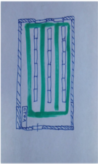
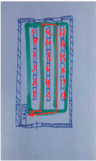

У компании имеется следующии склад (см. рис), три ряда стеллажей, стоящие в ряд по 700 ед. Каждый стеллаж содержит 5 полок. Каждая полка содержит 6 ячеек. Между рядами
стеллажей есть проходы. Между стеллажами в одном ряду проходов нет. Ширина полок одинакова и равна ширине прохода. Зеленым цветом обозначены проходы.
Кладовщику выдается случайный перечень ячеек, из которых требуется взять товар. Помогите составить маршрут передвижения кладовщика по складу, начиная движение от
стола, таким образом, чтобы он затратил минимально возможный путь.

1. Достаточно описать шаги алгоритма решения задачи.
2. Объясните почему решение оптимальное.

# Решение
Предположим, что ячейки из перечня распределены по стеллажам равномерно и их много.

Сначала стеллажи в перечне нужно отсортировать следующим образом: числами 1-12 обозначить стеллажи на западе и в центре. Западные нечеными, центральные четными. Восточные стеллажи разметить в обратном порядке и добавить в конец. Пройти на север между западным и центральным стеллажом, проверяя их в порядке возрастания, затем на юг чере проход между центральным и восточным стеллажом, затем обратно к столу.

Решение покрывает проходы между всеми шкафами и минимизирует переходы между рядами
